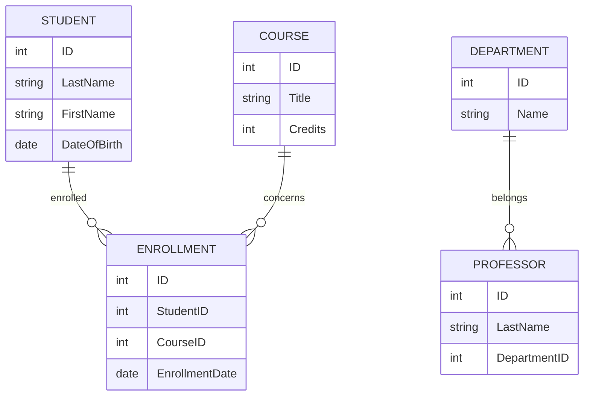
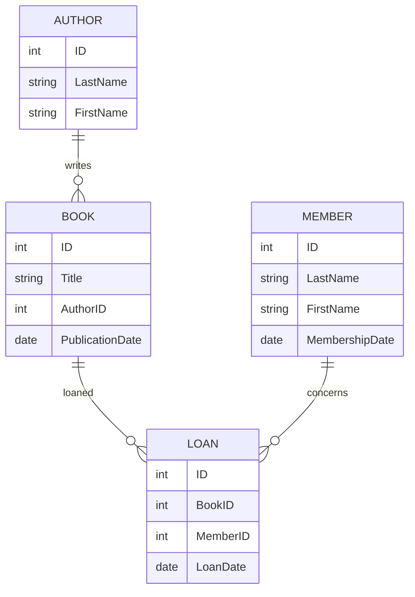

### C10 - Concevoir l’architecture des bases de données à l’aide d’un outil de modélisation afin de représenter la structure de la couche de persistance nécessaire au fonctionnement de l’application ou du site web

#### C10.1 - Recenser les informations / données du domaine

Pour concevoir une architecture de base de données efficace, j'ai commencé par recenser les informations et les données spécifiques au domaine de l'application. Cette étape cruciale impliquait l'identification des entités principales, des attributs et des relations existantes entre ces entités. Par exemple, dans le cadre d'une application de gestion des étudiants, j'ai identifié les entités suivantes : Students, Courses, Enrollments, Professors, et Departments. J'ai mené des entretiens avec les parties prenantes, analysé les documents de spécifications et étudié les processus métiers afin de collecter l'ensemble des données pertinentes. Cette collecte exhaustive des informations m'a permis d'avoir une vision claire et complète des besoins en matière de données, facilitant ainsi la phase de modélisation.

#### C10.2 - Établir le schéma entité-association des données et définir le schéma de la base de données afin de permettre l’élaboration d’une base de données normalisée

Suite au recensement des données, j'ai établi le schéma entité-association (ERD) en utilisant un outil de modélisation tel que MySQL Workbench ou Microsoft Visio. Par exemple, pour l'application de gestion des étudiants, le schéma ERD comprenait des entités comme Student (avec des attributs tels que ID, LastName, FirstName, DateOfBirth), Course (ID, Title, Credits), Enrollment (ID, StudentID, CourseID, EnrollmentDate), Professor (ID, LastName, DepartmentID), et Department (ID, Name). J'ai ensuite défini le schéma de la base de données en appliquant les principes de normalisation, afin d'éliminer les redondances et d'assurer l'intégrité des données. Cette étape incluait la création des tables, la définition des clés primaires et étrangères, ainsi que la mise en place des contraintes nécessaires pour garantir la cohérence des données.

#### C10.3 - Dans le cas d’une base de données existante, déduire le schéma entité-association des données de la base à faire évoluer

Lorsque j'ai dû travailler sur une base de données existante, j'ai procédé à l'analyse de celle-ci pour en déduire le schéma entité-association. Par exemple, pour une base de données de gestion de bibliothèque, j'ai utilisé un outil de rétro-ingénierie comme MySQL Workbench pour générer un diagramme entité-association à partir des tables existantes telles que Books, Authors, Loans, et Members. L'analyse a révélé des tables comme Book (ID, Title, AuthorID, PublicationDate), Author (ID, LastName, FirstName), Loan (ID, BookID, MemberID, LoanDate), et Member (ID, LastName, FirstName, MembershipDate). Cette approche m'a permis d'identifier les éventuelles anomalies ou besoins d'évolution, comme l'ajout de nouvelles entités ou la modification des relations existantes.

Cette démarche permet de garantir que la base de données évolue de manière structurée et optimisée, tout en répondant aux nouvelles exigences du projet.
